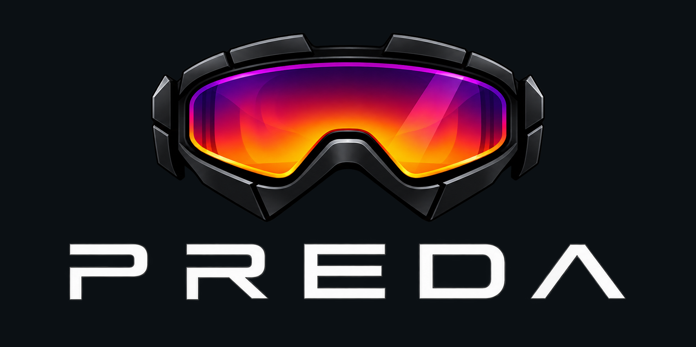

<p align="center">
  <picture>
    <source media="(prefers-color-scheme: dark)" srcset="logo.png">
    
  </picture>
</p>

<p align="center">
  An experimental thermal and phone-camera viewer for Cardboard-style Android headsets.
</p>

<p align="center">
  
</p>

<p align="center">
  <video src="https://github.com/user-attachments/assets/fc1c3eca-3ca9-49ca-9509-ad73031aaa2d" controls></video>
</p>

Preda turns an Android phone into a Predator-style vision headset. It displays the phone camera or a supported USB-C thermal camera in two lens-corrected eye views.

> [!NOTE]
> Preda is an experimental hardware project, not a safety device. Do not rely on it for navigation, medical use, firefighting, or other safety-critical decisions.

## Hardware

<p align="center">
  
</p>

| Item | Rough cost | Notes |
| --- | ---: | --- |
| [Cardboard-style VR headset](https://www.amazon.fr/dp/B0H8NNQ9H4) | EUR 33 | Any compatible phone headset should work, but ideally choose one that doesn’t obstruct your phone’s camera lenses. |
| [Infiray T2L thermal module](https://fr.banggood.com/InfiRay-T2L-256+192-Thermal-Imager-Camera-Infrared-Thermometer-Imager-Industrial-Tester-Imaging-Camera-for-Mobile-Phone-Android-p-1952576.html?cur_warehouse=HK) | EUR 133 | Previously cost more than EUR 300; price and availability vary. Any similar USB-C thermal module should work.|
| Spare Android phone | EUR 0 if already owned | Must meet the Android, OpenGL ES, and USB-host requirements above. |
| **Estimated total (Sep 2026)** | **About EUR 166** | Excludes the phone, shipping, taxes, and any USB-C/OTG adapter. |

The Infiray T2L enclosure is available as a [ready-to-slice 3MF file](T2L_enclosure.3mf) and an [editable STEP model](T2L_enclosure.step). You can also find the model and printing details on [MakerWorld](https://makerworld.com/models/3247659-infiray-t2l-thermal-vison-module-enclosure).

## Controls

| Input | Action |
| --- | --- |
| Volume Down | Cycle camera source |
| Volume Up | Cycle thermal palette |

Connect the thermal camera before launching Preda. Grant the camera permission on first launch and the separate USB permission when Android prompts for it.

## Build

### Prerequisites

- JDK 17
- Android SDK Platform 36
- Android SDK Platform Tools for installing with `adb`

Clone the repository and build the debug APK:

```bash
git clone https://github.com/tducret/preda.git
cd preda
./gradlew :app:assembleDebug
```

Install and launch it on a connected Android device:

```bash
./gradlew :app:installDebug
adb shell am start -n com.example.vrviewer.debug/com.example.vrviewer.MainActivity
```

Run all local checks:

```bash
./gradlew :app:lint
./gradlew :app:testDebugUnitTest
```

## Architecture

Preda is a single-module Kotlin application. Jetpack Compose hosts a custom `GLSurfaceView`; camera2 supplies phone-camera frames, AUSBC/libuvc supplies USB thermal frames, and an OpenGL ES 3.0 renderer performs stereo viewport layout, palette mapping, and barrel distortion. UI state is exposed through a `ViewModel` and `StateFlow`.

## Current Limitations

- The same camera image is shown to both eyes; this is not binocular depth or 3D reconstruction.
- Split mode intentionally sends different sensors to each eye and may be uncomfortable for some users.
- There is no head tracking, recording, radiometric temperature measurement, or Cardboard QR-profile selection.
- USB hot-plug changes may require restarting the app before the source appears.
- Phone lens availability and naming depend on what each device exposes through camera2.
- Hardware compatibility outside the tested Infiray camera and ARM64 Android devices is not guaranteed.

## Contributing

Issues and focused pull requests are welcome. For hardware-related reports, include the Android version, phone model, camera model, and relevant `adb logcat` output after removing personal or device-identifying information.

## License

Preda is available under the [MIT License](LICENSE). Third-party dependencies and bundled native components remain subject to their respective licenses.
